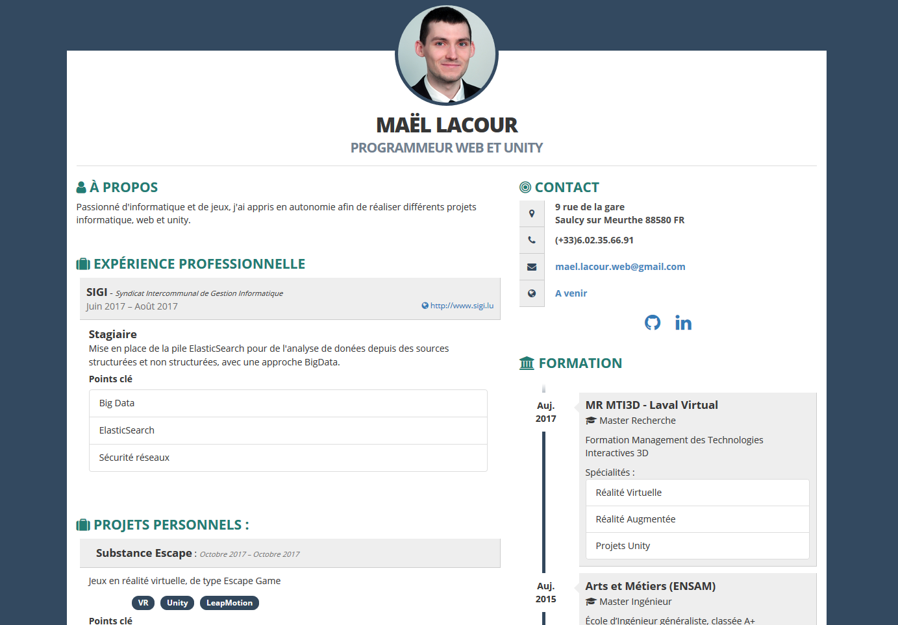

# Custom JSONResume theme based on kendall

A theme for JSONResume, __in French__, that relies on Bootstrap and FontAwesome.

## Example

You can get a resume wich look like this one :

## Usage

You can use [resume-cli](https://github.com/jsonresume/resume-cli) OR [HackMyResume](https://github.com/hacksalot/HackMyResume) to obtain your resume.

### Exemple with HackMyResume :
 * Get HackMyResume : [sudo] npm install hackmyresume -g
 * Download the theme : git clone https://github.com/Eyap53/jsonresume-theme-bluewhale-fr.git
 * Install dependencies : npm install
 * Render your resume with something like : hackmyresume BUILD resume_fr.json TO out/resume.all --pdf none -t jsonresume-theme-bluewhale-fr

## Tips

As of now, the theme supports the following profiles in the basics.profiles array.

* Facebook
* Github
* Twitter
* Google Plus
* YouTube
* Vimeo
* Linkedin
* Pinterest
* Flickr
* Behance
* Dribbble
* CodePen
* Soundcloud
* Steam
* Reddit
* Tumblr
* Stack Overflow
* Bitbucket
* Gitlab

Every single one of these is optional, and every field in the basics.profiles array **must** be entered without spaces. This theme will try to use the matching `-square` version of the icon from FontAwesome if it doesn't already have support for one of your profiles. If you want support for more social networks, feel free to leave an issue, or even better, submit a pull request. Thanks.

If you want to keep your resume mobile-friendly, please limit the number of profiles to 10, please. No one should have over 10 profiles on their resume anyway.

Every section is optional also. If per se, you do not include the publications array in your resume.json, no publications section will appear.

If you find any other problems with this theme in specified, do feel free to leave an issue. Thanks.

## Authors

* **Adam Kendall** - *Initial work* - [LinuxBozo](https://github.com/LinuxBozo)
* **Mael Lacour** - *Translation, modifications* - [Eyap53](https://github.com/Eyap53)

The initial work of Adam Kendall is under MIT license. See the [initial license](initial-license) file for details

## License

This project is licensed under the MIT License - see the [LICENSE](LICENSE) file for details
